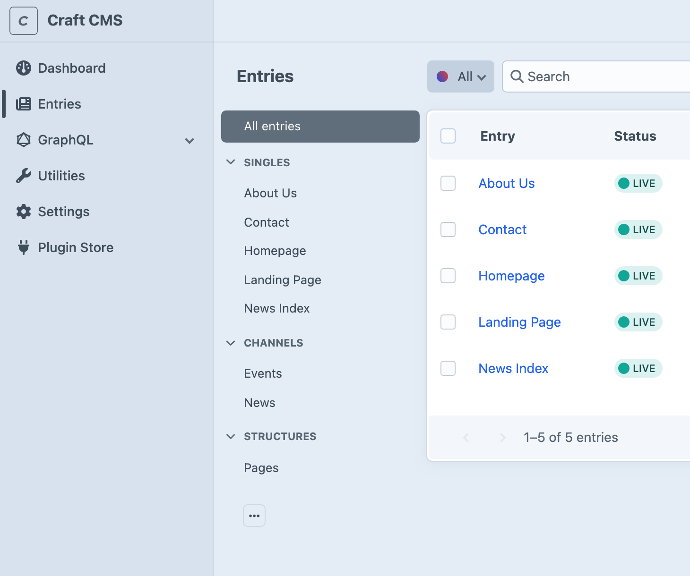

<!-- feature-intro -->
A small Craft plugin that lists Single sections directly in the Entries sidebar instead of grouping them under one “Singles” item. It is particularly handy when a site has plenty of Singles, or when editors simply need a clearer view of where content lives.
<!-- feature-intro-end -->

<!-- feature-media -->
## Free your Singles

Expanded Singles brings each Single out into its own sidebar item, using the section name editors already recognise. Rearrange them with Craft’s own sidebar customisation and optionally go straight to the entry when an index would only add another click.

<!-- feature-media-end -->
